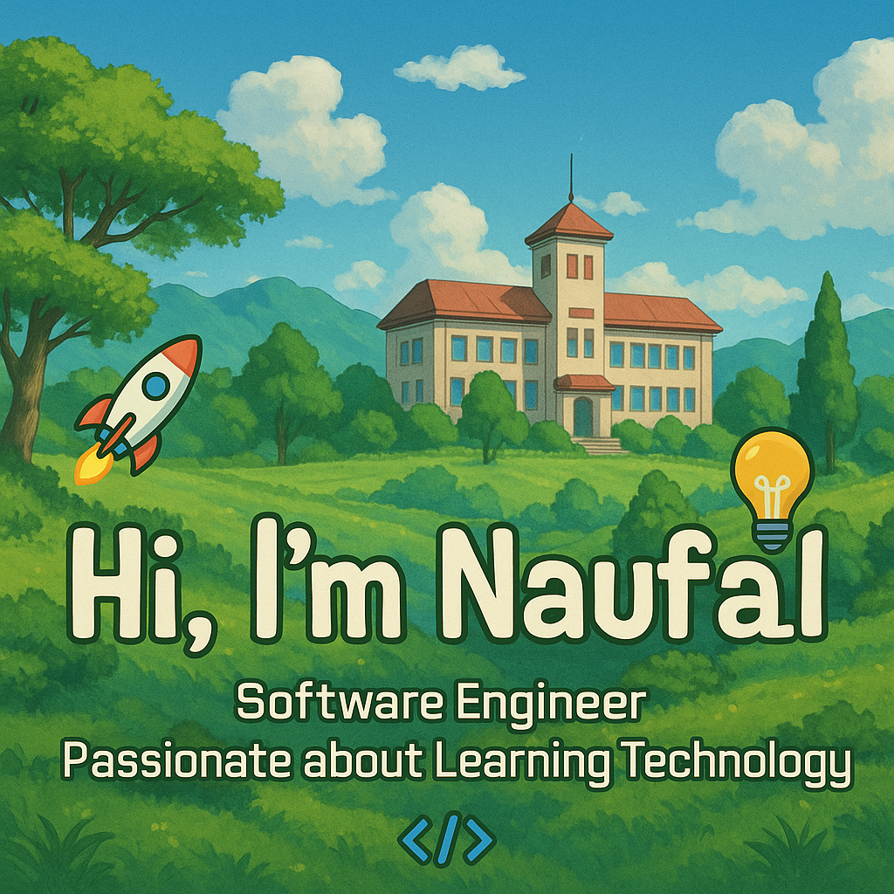

  

I'm a **Software Engineer** passionate about learning new technologies and building scalable backend systems.
Fresh graduate from **Telkom University** majoring in Informatics — always eager to learn and collaborate in the world of tech!
I love solving problems and exploring tools that make development better and faster 🚀

---

### 🛠 Tech Stack

---

### 📊 GitHub Stats

  

  

  

### 📫 Let’s Connect!
- ✉️ Email: [mnaufalrifqir@gmail.com](mailto:mnaufalrifqir@gmail.com)
- 💼 LinkedIn: [linkedin.com/in/mnaufalrifqir](https://www.linkedin.com/in/mnaufalrifqir/)

---
